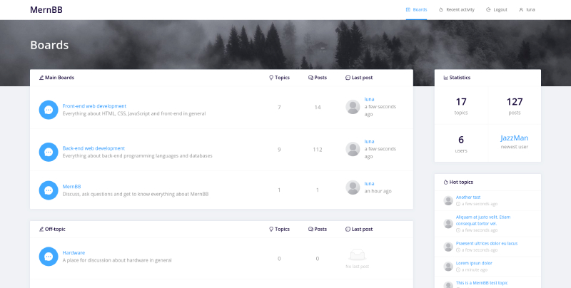

# MernBB

A forum board built with Node/MongoDB/React

## :pencil: Description 

Using the MERN stack, this is a bulletin board where users can authenticate and post topics and reply to them in different categories divided by subcategories. The user can authenticate with JWT to start consuming an API with CRUDs and other operations for categories, subcategories, users, user groups, topics and posts.

[Live example](https://mernbb.herokuapp.com/)

### :pushpin: Technologies used

* React with hooks
* React Router
* Ant Design
* JWT authentication via Passport.js
* Node
* MongoDB

### :rocket: Roadmap

* Make everything responsive
* Edit user profile
* View user profile
* Dashboard for administrators
* Manage user groups, categories and subcategories in the dashboard
* WYSIWYG text editor
* Delete and topics and posts
* ... a lot of other things!

## :zap: Getting Started

### :package: Installing

* Clone this repo

      git clone https://github.com/henrispkl/MernBB.git

* Go to the folder and install all dependencies

      cd MernBB/
      npm install

* Rename the `.env.example` file to `.env`, add a MongoDB connection string and change the JWT secret.

      mv .env.example .env

* Build the project

      npm run build

### :fire: Executing

* Running in development mode

      npm run dev

* Executing in production

      npm start

## :+1: How to contribute

To contribute to this project, feel free to create pull requests and issues and I'll gladly take a look at them. :)

## :page_facing_up: License

This project is licensed under the MIT License. I :heart: open source stuff!